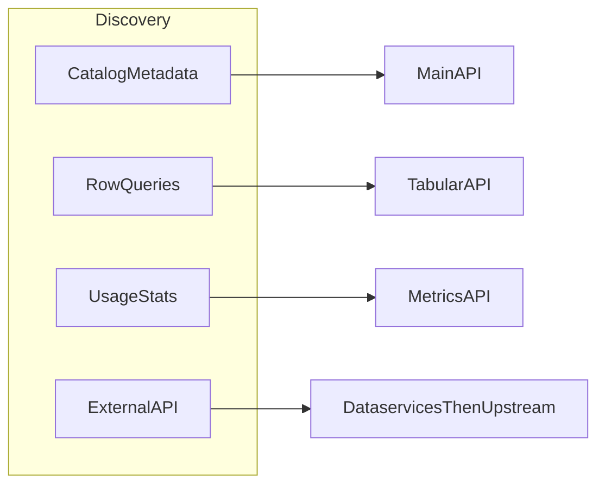

# data.gouv.fr APIs

Three HTTP APIs (**Main**, **Metrics**, **Tabular**) plus **dataservices** (external HTTP APIs described on the platform; they used to be referenced on **api.gouv.fr** and are now **dataservices** on data.gouv.fr). This skill is consumption-first: routing and workflows here; endpoint tables in [references/](references/). Writes only when the user explicitly wants them and an API key is available.

---

## How to use this skill

- **MCP first:** If the client exposes **data.gouv.fr MCP** tools, use them for conversational catalog exploration; they orchestrate the same platform capabilities with typed tool calls. For **dataservices** in particular, **`search_dataservices`** matches the intent of `GET /dataservices/`; after a hit, load the detail record (`machine_documentation_url`, `base_api_url`, etc.) via MCP or via `GET /dataservices/{id}/` before calling the upstream API. Endpoint: `https://mcp.data.gouv.fr/mcp`. Repos: [datagouv-mcp](https://github.com/datagouv/datagouv-mcp), [datagouv-skill](https://github.com/datagouv/datagouv-skill). Tool names vary by server version—follow the host's tool list and fall back to the HTTP endpoints in [references/](references/) when MCP is missing or insufficient (dataservices: `GET https://www.data.gouv.fr/api/1/dataservices/` with `q`, filters, and `next_page`, then `GET /dataservices/{id}/`).
- **HTTP otherwise:** Read the matching [reference file](#reference-files-load-on-demand) before calling routes beyond the examples below. Prefer **GET** responses over assumptions: do not invent dataset or resource IDs; cite **slugs**, **UUIDs**, and **URLs** returned by the API.
- **Automation vs chat:** MCP suits interactive exploration; the **Main API** suits reproducible scripts and the full route surface.
- **Writes (atypical):** Never log or echo `X-API-KEY`. Use POST/PUT/PATCH/DELETE only with clear user intent **and** a configured key. On **401/403**, distinguish missing key from insufficient permissions; on **404**, re-check id vs slug and use search. Do not expand into full producer pipelines here.

---

## Choosing an API (intent → surface)

| User goal | Use |
|-----------|-----|
| Search or read catalog metadata, resources, orgs, reuses, discussions | **Main API** — e.g. `GET /datasets/`, `GET /datasets/{id}/`; routes in [references/main-api.md](references/main-api.md) |
| Filter/sort/paginate **rows** of a CSV resource hosted for Tabular | **Tabular API** — workflow below; routes in [references/tabular-api.md](references/tabular-api.md) |
| Platform **usage / statistics** (models such as `dataset`, `organization`, `site`) | **Metrics API** — [references/metrics-api.md](references/metrics-api.md); Swagger for `{model}` and column filters |
| Call an **external** API (legacy catalog: api.gouv.fr; now **dataservices** on data.gouv.fr) | **Dataservices** — MCP **`search_dataservices`** or `GET /dataservices/`; see [Dataservices workflow](#dataservices-workflow) and [references/dataservices.md](references/dataservices.md) |
| Prepare or document data before publication (no write API) | **open-data-practices** (planned) — teaser in [Producer coaching](#producer-coaching-documentation-and-publication-quality); full doc in `references/open-data-practices.md` |

---

## Identifiers and catalog visibility

- **Technical UUID vs slug:** Both work in many paths; **prefer the UUID** from API responses for stable automation.
- **Resolve before Tabular:** Tabular `{rid}` is the resource **UUID** from `GET /datasets/{id}/` (or `.../resources/`). If you only have a slug, `GET` the dataset first and read `resources[].id`.
- **Stable resource link:** `GET /datasets/r/{id}/` redirects to the latest resource for that id.
- **Search is not "the whole web":** `GET /datasets/` supports filters such as **`archived`**, **`deleted`**, **`private`**. Defaults may hide some records; set query params explicitly when the user needs a full picture and the key allows it.

---

## Pagination and rate limits

- Lists return `data`, `page`, `page_size`, `total`, `next_page`, `previous_page`. Follow **`next_page`** until empty instead of guessing page counts.
- Use a **reasonable `page_size`**; avoid hammering the service or downloading the entire catalog page by page without need.
- Respect **`X-RateLimit-Limit`**, **`X-RateLimit-Remaining`**, **`X-RateLimit-Reset`**: slow down or backoff when remaining is low.

---

## Demo vs production

- **Production:** `https://www.data.gouv.fr/api/1/` (Main), `https://metric-api.data.gouv.fr` (Metrics), `https://tabular-api.data.gouv.fr` (Tabular).
- **Demo:** `https://demo.data.gouv.fr/api/1/` — for tests only; do not present demo results as production facts unless the user asked for demo.

---

## Glossary

- **Dataset:** A catalog entry (metadata, licence, frequency, tags) grouping **resources**.
- **Resource:** A file or API link attached to a dataset (CSV, JSON, GeoJSON, etc.); each has an id used by Tabular when the file is tabular-compatible on the platform.
- **Organization / producer:** Publisher entity; datasets may belong to an organization.
- **Reuse:** A project or article that references platform datasets or dataservices.
- **Dataservice:** A documented external HTTP API (OpenAPI/Swagger often at `machine_documentation_url`) with a **`base_api_url`** for calls. Same class of APIs that were once referenced on **api.gouv.fr**; the catalog entry on the open data platform is now a **dataservice**.
- **Slug:** Human-readable id in URLs; may change; UUID is safer for scripts.

---

## Producer coaching (documentation and publication quality)

When the user asks how to **prepare, document, or legally qualify** data for publication on data.gouv.fr **without** using write APIs here, **ground** answers in the official guides (fetch pages if the client allows, otherwise give links): [Guide qualité](https://guides.data.gouv.fr/guides/guide-qualite.md), [Guide juridique](https://guides.data.gouv.fr/guides/guide-juridique.md). This skill is **not** legal advice; encourage human review for obligations and licensing. Extended guidance: `references/open-data-practices.md` (planned).

---

## Intent routing (optional)



---

## Reference files (load on demand)

Before calling HTTP routes beyond the examples below, read the matching file (resolve paths relative to this skill directory):

| When | Read |
|------|------|
| Main API routes (datasets, orgs, users, …) | [references/main-api.md](references/main-api.md) |
| External APIs via catalog (dataservices) | [references/dataservices.md](references/dataservices.md) |
| Usage / statistics | [references/metrics-api.md](references/metrics-api.md) |
| CSV row filters, sorts, aggregations | [references/tabular-api.md](references/tabular-api.md) |
| Publication quality / legal prep (planned) | references/open-data-practices.md |

---

## Main API (summary)

**Base URL:** `https://www.data.gouv.fr/api/1/` | Demo: `https://demo.data.gouv.fr/api/1/`

**Auth:** Read public. Write: header `X-API-KEY`. Prefer technical id over slug. Full route tables: [references/main-api.md](references/main-api.md).

---

## Dataservices workflow

**To use a dataservice:** (1) Find it: MCP **`search_dataservices`** or `GET /dataservices/?q=term` (follow **`next_page`** until done). (2) GET `/dataservices/{id}/` for `machine_documentation_url` and `base_api_url`. (3) Fetch `machine_documentation_url` for the OpenAPI spec. (4) Call **`base_api_url`** per that spec. Details: [references/dataservices.md](references/dataservices.md).

---

## Metrics API (summary)

**Base URL:** `https://metric-api.data.gouv.fr` | Swagger: https://metric-api.data.gouv.fr/api/doc

Read [references/metrics-api.md](references/metrics-api.md) before complex queries. `{model}` = table name (e.g. site, organization, dataset).

---

## Tabular API (summary)

**Base URL:** `https://tabular-api.data.gouv.fr` | Swagger: https://tabular-api.data.gouv.fr/api/doc

**Tabular data workflow (use in order):**

1. `GET /api/resources/{rid}/` — confirm the resource is exposed and get links.
2. `GET /api/resources/{rid}/profile/` — column types, stats, indexes.
3. `GET /api/resources/{rid}/swagger/` — allowed query params and operators per column (read before complex filters).
4. `GET /api/resources/{rid}/data/` — `page` and `page_size` (max **50**). For aggregations, check `/api/aggregation-exceptions/` first.

Filter operators and route table: [references/tabular-api.md](references/tabular-api.md).

---

## Quick examples

```python
import requests

BASE = "https://www.data.gouv.fr/api/1"

# 1) Search catalog, then open first hit
r = requests.get(f"{BASE}/datasets/", params={"q": "transport", "page_size": 5}).json()
first = r["data"][0]
ds = requests.get(f"{BASE}/datasets/{first['id']}/").json()

# 2) Pick a CSV resource UUID, then Tabular profile + data (use any resource id exposed by Tabular)
csvs = [res for res in ds["resources"] if res.get("format", "").lower() == "csv"]
rid = csvs[0]["id"] if csvs else ds["resources"][0]["id"]
requests.get(f"https://tabular-api.data.gouv.fr/api/resources/{rid}/profile/").json()
requests.get(
    f"https://tabular-api.data.gouv.fr/api/resources/{rid}/data/",
    params={"page": 1, "page_size": 20},
).json()

# 3) Direct file download (when you need the raw file, not row filtering)
url = next(res["url"] for res in ds["resources"] if res["id"] == rid)
requests.get(url, stream=True)
```

```python
# Metrics API — paginated dataset metrics (models/columns in Swagger)
requests.get(
    "https://metric-api.data.gouv.fr/api/dataset/data/",
    params={"page": 1, "page_size": 20},
).json()
```

**Python client:** https://github.com/etalab/datagouv-client-python

---

## References and freshness

- **Main API Swagger (authoritative paths):** https://www.data.gouv.fr/api/1/swagger.json
- **Metrics / Tabular:** use their Swaggers linked above. If a path or parameter disagrees with these skill files, **trust the live Swagger**.
- **API guide (human, technical):** [Prise en main](https://guides.data.gouv.fr/api-de-data.gouv.fr/prise-en-main.md), [Référence API](https://guides.data.gouv.fr/api-de-data.gouv.fr/reference.md), [Télécharger le catalogue](https://guides.data.gouv.fr/api-de-data.gouv.fr/telecharger-le-catalogue-de-donnees-de-data.gouv.fr.md), [SPARQL](https://guides.data.gouv.fr/api-de-data.gouv.fr/acceder-au-catalogue-via-sparql.md).

For sharing with humans, dataset pages on `www.data.gouv.fr` use slugs from API fields; **metadata and ids** should still come from **GET** responses.
